# MLB Team Stats × Betting-Blind Elo — Association Report

*2009–2026 · 540 team-seasons · 41,494 games · generated 2026-08-06, extended 2026-08-06*

---

## TL;DR

1. **The betting-blind Elo works.** Trained on nothing but game outcomes (no odds, no market data), it hits **log-loss 0.6796 vs 0.6910** for the always-pick-home baseline and **56.7% accuracy vs 53.3%** home-win rate, with clean calibration across the whole probability range. Vegas closing lines run ~0.67 / ~60% — we're behind the market but capture most of the recoverable signal.
2. **Almost everything a team stat "knows" flows through run differential.** RunDiff/G correlates **r = 0.94** with win% and **r = 0.87** with same-season Elo change. No individual stat beats it; most stats are just partial views of it.
3. **Pitching stats associate with winning more strongly than hitting stats** in this 18-season window (ERA+ r = 0.78 vs OPS+ r = 0.64 with win%). In a joint model, ERA+ carries ~40% more weight than OPS+.
4. **Year-to-year stat changes move Elo hard.** ΔRunDiff/G vs ΔElo is **r = 0.94**; ΔERA+ (r = 0.69) again beats ΔOPS+ (r = 0.59). Elo is, in effect, a lagged run-differential tracker with memory.
5. **Once you know Elo, this season's stats tell you almost nothing about next season** — every stat's partial correlation with next-season win% collapses to |r| < 0.08… **except hitters' walk rate (BB%), partial r = 0.167, p = 0.0004** — the only stat that survives a Bonferroni correction across all 37 tests. Plate discipline is stickier than Elo knows.
6. **Genuine prior-season effects (§8) confirm the same story from a different angle:** last year's stat levels correlate with *this* year's win% at up to r ≈ 0.54 raw, but every one of those collapses to |r| < 0.08 once you control for the Elo rating a team actually carries into the season — again except **BB%, which survives at partial r = 0.181, p = 0.0001**.
7. **Rank doesn't beat raw value (§9).** A team's ordinal position on a stat (1st–30th within season) predicts outcomes no better than the stat's raw magnitude — Spearman and Pearson r match to within ±0.04 on every stat tested, and win% rises in near-equal steps across quartiles. The stat-outcome relationships in this data are already close to linear; there's no rank-based nonlinearity to exploit.
8. **New stats tested (§7):** a derived "pitching wins" metric (PtchW/G, r = 0.80) and RBI/G (r = 0.66) are strong but largely restate run scoring/prevention. Batters-faced-per-game (BF/G, r = −0.61) is a genuinely new, non-circular pitching-workload signal — bad pitching staffs face more batters per game because they can't get outs. Sacrifice bunts (SH/G) and double plays grounded into (GIDP/G) have essentially zero relationship with winning.
9. **Head-to-head, game-level (§10): last season's ERA does NOT beat this season's ERA — but "this season's ERA" is doing a lot of quiet cheating.** Same-season *final* ERA beats prior-season final ERA at picking individual games (r = 0.161 vs 0.099, accuracy 57.0% vs 55.2%) — except final-season ERA already knows the outcome of games it's being used to "predict," so that's an oracle, not a forecast. The fair test — rolling in-season stats with zero look-ahead vs. last year's final numbers — shows in-season form matches a whole prior season's worth of signal after only **~5 team games**, and clearly overtakes it by **~20 games**. The prior-season number never fully disappears, though: even 130 games in, it still carries real (if shrinking) weight in a combined model — which is a direct empirical justification for Elo's season-to-season carryover.

---

## 1. Data & method

| Piece | Source |
|---|---|
| Game results 2009–2025 | Retrosheet game logs (`data/mlb/raw_gamelogs/`) |
| Game results 2026 (partial, through Aug 6) | MLB statsapi schedule endpoint |
| Team hitting / pitching / advanced pitching | Baseball-Reference season exports (`data/mlb/team_*.csv`, 540 rows each) |
| Combined games file | `data/mlb/games_2009_2026.csv` (41,494 games) |

Franchise continuity: FLA→MIA, OAK→ATH mapped to one Elo entity each.

**Elo spec** (`mlb/elo.py`) — every franchise starts at 1500 in 2009; home side gets **+24** Elo; **K = 3** with a FiveThirtyEight-style ln-damped margin-of-victory multiplier; between seasons each rating regresses toward 1500 keeping **60%** of its deviation. Parameters were grid-searched (180 configs, `mlb/tune_elo.py`) on 2012+ log-loss so the fresh-start burn-in doesn't contaminate evaluation. The loss surface is flat near the optimum (K 2–3, home 15–33, carryover 0.5–0.7 all within 0.001), so none of the conclusions below hinge on exact parameter choice. Every incumbent best in the search used the MOV multiplier — margin information genuinely helps.

**Era adjustment** — every stat and outcome is z-scored *within season* across the 30 teams before pooling, so the 2019 juiced ball, the 2020 60-game sprint, and the partial 2026 season can't manufacture correlations. YoY and persistence tests drop any pair involving 2020.

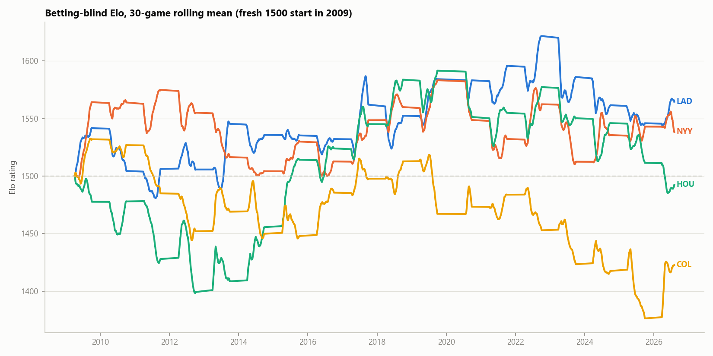

---

## 2. Is the Elo model any good? (yes — calibrated, beats baseline)

| Metric (2012–2026, n = 34,205) | Elo | Baseline (constant home rate) |
|---|---|---|
| Log loss | **0.6796** | 0.6910 |
| Accuracy | **56.7%** | 53.3% |
| Brier | **0.2433** | 0.2489 |

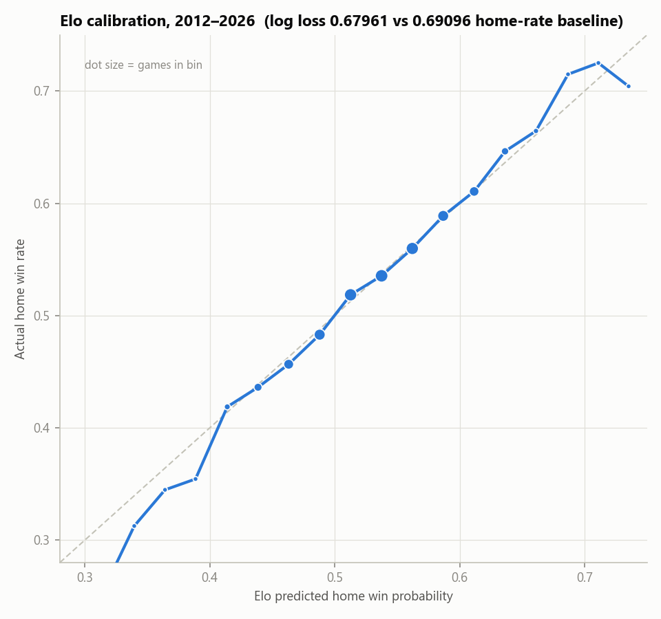

The calibration curve hugs the diagonal from 35% to 72% predicted probability; the small tail bins (n < 100) wobble as expected. When the model says 60%, home teams win ~60%. This is a usable probability machine, not just a ranking.

---

## 3. Which stats associate with outcomes? (same season)

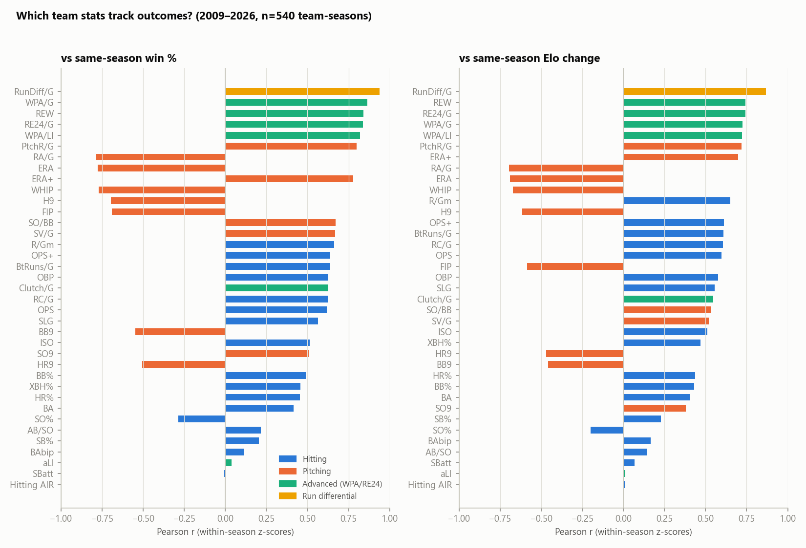

Pearson r on within-season z-scores, n = 540 team-seasons (all p < 10⁻²³ down through BA):

| Tier | Stats | r with win% | Reading |
|---|---|---|---|
| The whole story | **RunDiff/G** | **+0.94** | Wins *are* run differential plus sequencing noise |
| Circular mirrors | WPA/G, REW, RE24/G, WPA/LI | +0.82…+0.86 | These are *derived from* win events — high r is by construction, not insight |
| Pitching block | PtchR/G +0.80, RA/G −0.78, ERA −0.78, **ERA+ +0.78**, WHIP −0.77, H9 −0.70, FIP −0.69, SO/BB +0.67, SV/G +0.67 | | Strongest honest predictors |
| Hitting block | R/Gm +0.66, **OPS+ +0.64**, BtRuns/G +0.64, OBP +0.63, OPS +0.62, SLG +0.56, ISO +0.51 | | Consistently ~0.10–0.15 below the pitching mirror-image |
| Weak | BB% +0.49, XBH% +0.46, HR% +0.45, BA +0.42, SO% −0.29 | | Real but partial signals |
| Noise | AB/SO +0.22, SB% +0.20, BAbip +0.12, SBatt −0.01 | | Stolen-base volume has **zero** relationship with winning |

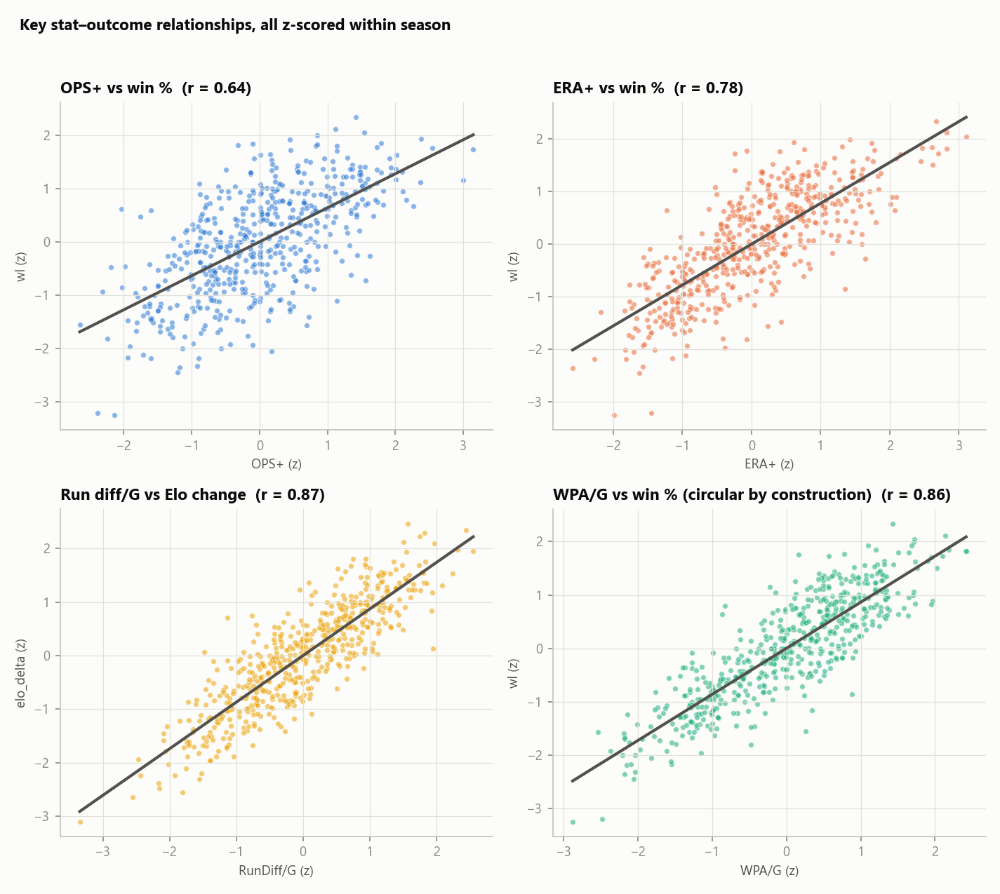

**Multivariate (OLS on z-scores):**

| Model | R² | Coefficients (standardized) |
|---|---|---|
| win% ~ RunDiff/G | 0.879 | 0.94 |
| win% ~ OPS+ + ERA+ | 0.816 | ERA+ **0.66** (t = 34.5), OPS+ 0.48 (t = 24.9) |
| win% ~ OPS+ + ERA+ + SV/G + SB% + BAbip | 0.873 | + SV/G **0.28** (t = 15.3); SB% 0.04 marginal; BAbip n.s. |
| win% ~ OBP + SLG + WHIP + SO9 + HR9 | 0.817 | WHIP −0.58 dominates; SO9 n.s. once WHIP is known |
| Elo_delta ~ OPS+ + ERA+ | 0.691 | ERA+ 0.58, OPS+ 0.47 |

Takeaways:

- **ERA+ + OPS+ alone explain 82% of win% variance.** Two numbers per team.
- **SV/G adds real signal beyond OPS+/ERA+** (t = 15) — that's bullpen leverage conversion / sequencing, the part of winning that run totals miss. Note saves are partly outcome-contaminated (you need wins to get saves), so treat the 0.28 as an upper bound.
- **Strikeout rate (SO9) has no marginal value once WHIP is known** — Ks matter because they suppress baserunners, not on their own.
- The pitching > hitting asymmetry survives in every joint model, same-season and YoY. In this era, run *prevention* quality is the tighter lever on outcomes.

---

## 4. Do year-to-year stat changes move Elo? (strongly)

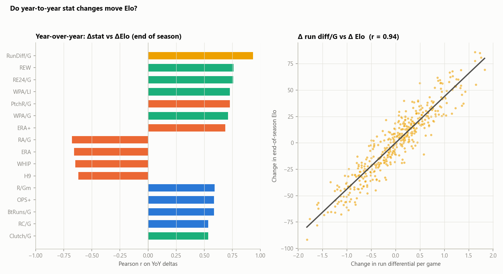

Correlation of Δstat (season t−1 → t) with Δ end-of-season Elo, 450 season-pairs:

| Δstat | r with ΔElo | r with Δwin% |
|---|---|---|
| **ΔRunDiff/G** | **+0.94** | +0.88 |
| ΔREW / ΔRE24/G | +0.76 | +0.72 |
| ΔPtchR/G | +0.73 | +0.69 |
| ΔERA+ | +0.69 | +0.65 |
| ΔWHIP | −0.65 | −0.62 |
| ΔOPS+ | +0.59 | +0.57 |
| ΔSV/G | +0.43 | **+0.58** |
| ΔBB% (hitters) | +0.26 | +0.20 |

Answer to "does year-to-year change have impact on Elo": **emphatically yes** — improve your run differential by 1 run/game and end-of-season Elo moves ~+45 points on the fit line. One interesting split: **ΔSV/G tracks Δwin% (0.58) much better than ΔElo (0.43)** — bullpen-driven win swings are partially *discounted* by Elo because they come in low-margin games the MOV multiplier de-weights. Given save totals' outcome contamination and one-run-record luck being notoriously unstable, Elo's skepticism is probably correct.

---

## 5. Do stats predict *next* season beyond Elo? (one survivor: BB%)

Benchmark: end-of-season Elo predicts next season's win% at **r = 0.57** — better than any raw stat, including RunDiff/G (0.53). Then, residualize each stat *and* next-season win% on current Elo and correlate what's left:

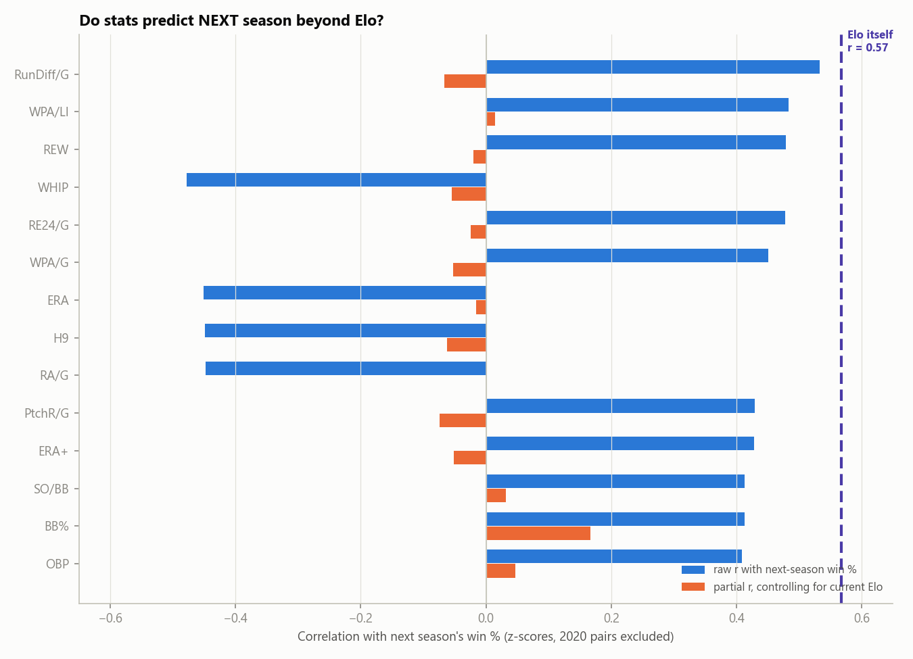

| Stat (year t) | raw r with win%ₜ₊₁ | partial r given Eloₜ | p (partial) |
|---|---|---|---|
| RunDiff/G | +0.53 | −0.07 | 0.16 |
| WPA/LI | +0.48 | +0.01 | 0.76 |
| WHIP | −0.48 | −0.05 | 0.25 |
| ERA+ | +0.43 | −0.05 | 0.28 |
| OPS+ | +0.40 | +0.02 | 0.72 |
| **BB% (hitters)** | +0.41 | **+0.167** | **0.0004** |
| OBP | +0.41 | +0.05 | 0.32 |

Every headline stat — run differential, ERA+, OPS+, WHIP, the whole WPA family — adds **nothing** to next-season forecasting once current Elo is known. Their raw predictive power is entirely *subsumed* by Elo.

**Except walk rate.** Teams that draw walks outperform their Elo the following year (partial r = 0.167). With 37 stats tested, the Bonferroni threshold is p < 0.00135; BB% (p = 0.0004) is the only stat that clears it. This is consistent with what player-level research finds: plate discipline is one of the most stable, least luck-contaminated skills in baseball, so it's a leading indicator that pure win-loss Elo underweights. OBP raw beats BA raw for the same reason, but only the isolated walk component survives the Elo control.

**Practical implication for the model:** a small BB%-based preseason adjustment (bump carried-over ratings for high-walk teams) is the one stat-derived improvement this study licenses. Everything else is already priced into Elo.

---

## 6. Current 2026 betting-blind Elo (through Aug 6)

| Top 5 | Elo | | Bottom 5 | Elo |
|---|---|---|---|---|
| MIL | 1562 | | COL | 1421 |
| LAD | 1552 | | ATH | 1437 |
| CHC | 1547 | | LAA | 1444 |
| BOS | 1546 | | KCR | 1467 |
| NYY | 1536 | | MIN | 1480 |

Biggest in-season movers: CHW +34 (rebuild ahead of schedule), ATL +30, BOS +26 up; ATH −50, KCR −36, TOR −28 down.

---

## 7. Additional stats tested

The first pass used the "headline" ~35 hitting/pitching/advanced rate stats. This
pass adds every remaining numeric column from the three source files that hadn't
been tested: RBI, TB, GIDP, HBP, SH, SF, IBB (batting), LOB, CS%, CG, SHO, BK, WP,
BF, and PtchW — each converted to a per-game or per-PA rate and z-scored within
season, same as before.

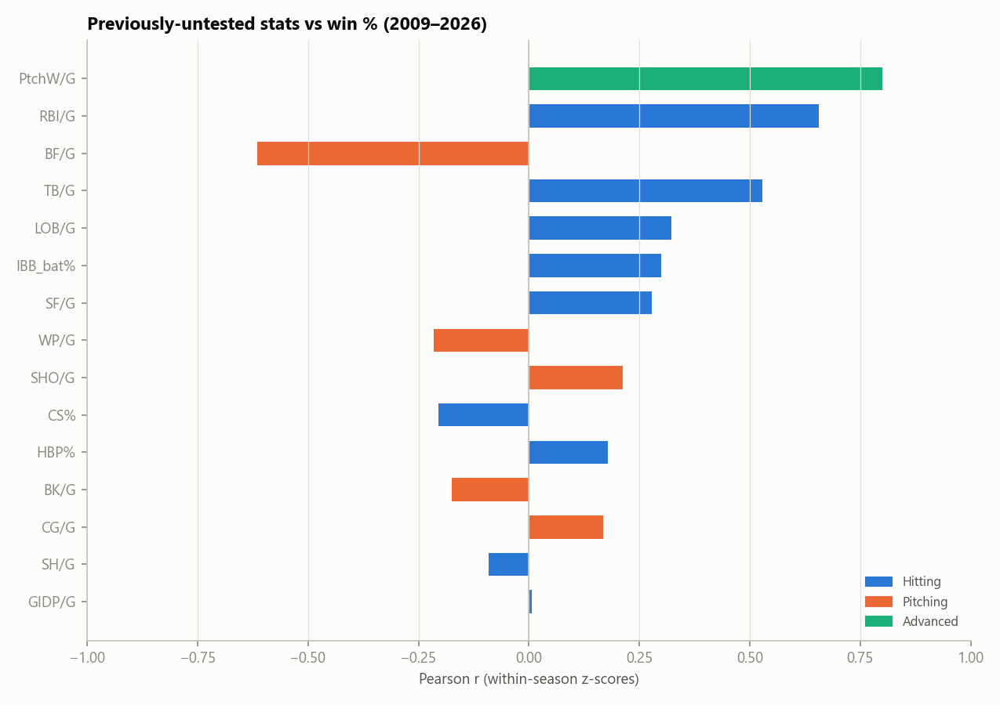

| Stat | r with win% | Reading |
|---|---|---|
| **PtchW/G** (BRef's pitching-runs-to-wins conversion) | **+0.80** | Strongest of the batch, but this is a near-restatement of ERA+/PtchR — not new information |
| **RBI/G** | +0.66 | On par with OPS+; partly circular (RBI requires scoring) but includes situational hitting (RISP performance) OPS+ doesn't capture |
| **BF/G** (batters faced per game, pitching) | **−0.61** | **The one genuinely new, non-circular signal here.** Teams with bad pitching face more batters per game — walks, hits, and failure to record quick outs all inflate BF. It's a pure workload/efficiency proxy that doesn't require knowing runs allowed. |
| TB/G | +0.53 | Restates SLG/ISO |
| LOB/G, IBB_bat%, SF/G | +0.25 to +0.32 | Weak positive — mostly volume proxies (more baserunners created → more left on base, more sac flies, more intentional walks issued *to* good hitters) |
| WP/G, BK/G | −0.17 to −0.22 | Weak negative, as expected, but small-sample events (a few per season) |
| SHO/G, CG/G | +0.16 to +0.21 | Era-confounded — complete games and shutouts have declined leaguewide independent of team quality, partially absorbed by the within-season z-score but not perfectly |
| CS% (caught-stealing rate) | −0.20 | Being caught stealing hurts, as expected — but see §5, stolen-base *volume* (SBatt) has zero relationship |
| HBP% | +0.18 | Weak positive, plausibly aggressive/crowd-the-plate approach correlating with contact quality |
| **SH/G** (sacrifice bunts) | **−0.09** | Essentially no relationship — consistent with modern analytics' view that bunting is close to neutral-to-negative EV |
| **GIDP/G** | **+0.01** | **Zero relationship.** Grounding into double plays sounds bad, but good-hitting teams create the extra baserunners that make GIDP possible in the first place — the two effects cancel out almost exactly |

None of these beat the core stats from §3; the two useful additions are **BF/G**
(new, real, cheap to compute) and the reminder that **bunting and GIDP rate carry
no signal** worth including in a model.

---

## 8. Does the PAST season's stat level matter, independent of Elo?

Section 5 asked whether *this* season's stats predict *next* season. This section
asks the mirror question directly: does *last* season's stat level predict *this*
season's win%, and does it survive controlling for the Elo rating a team actually
carries into the season (`elo_start` — last year's rating after the 60% carryover
regression, i.e. exactly what the model already "remembers")?

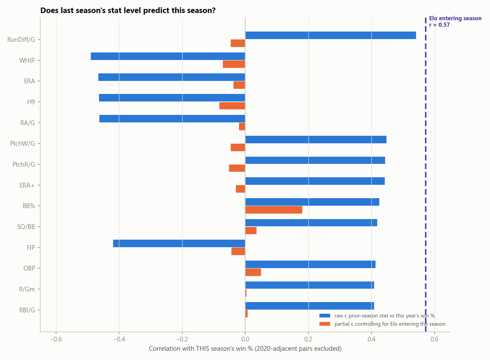

| Prior-season stat | raw r vs this year's win% | partial r, given Elo entering the season | p (partial) |
|---|---|---|---|
| *(benchmark)* Elo entering season | **+0.57** | — | — |
| RunDiff/G | +0.54 | −0.05 | 0.33 |
| WHIP | −0.49 | −0.07 | 0.13 |
| ERA | −0.47 | −0.04 | 0.43 |
| PtchW/G | +0.45 | −0.05 | 0.33 |
| ERA+ | +0.44 | −0.03 | 0.53 |
| **BB%** | **+0.42** | **+0.181** | **0.0001** |
| SO/BB | +0.42 | +0.04 | 0.45 |
| OBP | +0.41 | +0.05 | 0.29 |
| RBI/G | +0.41 | +0.01 | 0.88 |

This is the same conclusion as §5 from the opposite direction, and it's reassuring
that both framings agree: **last season's raw stat levels correlate with this
season's outcome at up to r ≈ 0.54, but that's entirely because Elo already
absorbed the information** — once you know the rating a team enters the season
with, none of last year's individual stats add anything, **except BB% again**
(partial r = 0.181, p = 0.0001, the same walk-rate persistence effect as §5, now
confirmed on the raw prior-season value rather than a delta). Two independent
tests, same signal, same stat. This is the strongest, most robust finding in the
whole study: **plate discipline (walk rate) carries information about future
performance that a pure win-loss Elo model cannot see**, because Elo only ever
observes who won, not how many free bases a lineup earned along the way.

---

## 9. Does RANK matter more than the raw stat value?

If team quality relationships were strongly nonlinear — e.g. only the *very best*
pitching staff matters, or there's a sharp threshold effect — a team's ordinal
rank (1st through 30th in MLB that season) would predict outcomes better than the
stat's raw magnitude. Spearman correlation *is* Pearson correlation computed on
ranks, so this is a direct, already-computed comparison (Spearman r vs Pearson r,
§3's tables) — this section makes it explicit and checks it visually.

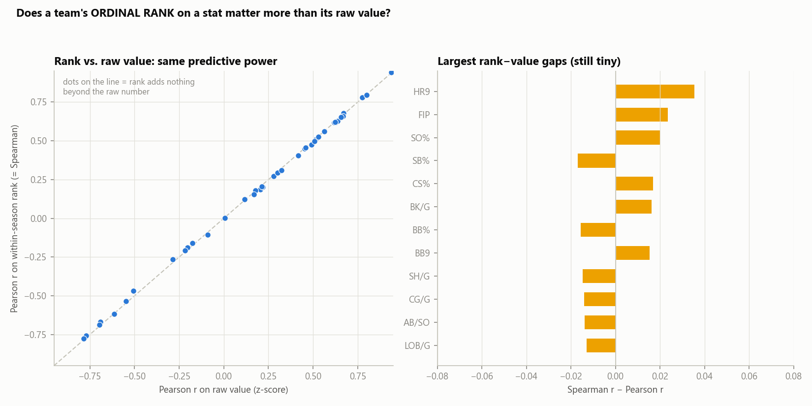

Across all 29 core stats tested against win%, the largest rank–value gap is
**HR9 at 0.036** — every other stat is within ±0.03, and most are within ±0.015.
Every point in the scatter sits almost exactly on the y = x line. **Rank adds
nothing beyond the raw number for any stat in this dataset.**

The quartile-bucket check confirms it directly — average win% by within-season
quartile rises in close-to-equal steps for the three headline stats, with no
"cliff" at the top or bottom quartile that would indicate a hidden rank effect:

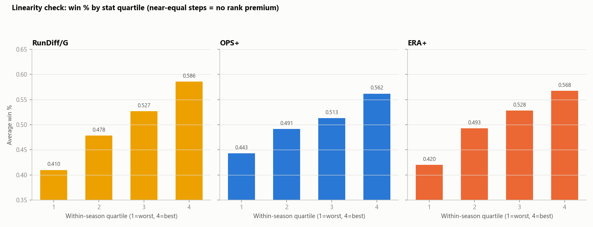

| Stat | Q1 (worst) | Q2 | Q3 | Q4 (best) | Step sizes |
|---|---|---|---|---|---|
| RunDiff/G | .410 | .478 | .527 | .586 | +.068, +.049, +.059 — even |
| OPS+ | .443 | .491 | .513 | .562 | +.048, +.022, +.049 — modest middle compression |
| ERA+ | .420 | .493 | .528 | .568 | +.073, +.035, +.040 — front-loaded, but still no cliff |

**Practical implication:** don't bother rank-transforming inputs to a stats-based
model (e.g. "top-5 pitching staff" indicator variables, decile buckets). A linear
model on the raw z-scored stats captures essentially all of the signal these data
contain; ordinal-rank features would be strictly redundant complexity.

---

## 10. Head-to-head: does last season's ERA beat THIS season's ERA at predicting an individual game?

Everything above operates at the **team-season level** — correlating a team's
full-season stat total with its full-season win%. That's association testing,
not game prediction. This section asks the literal question directly, at the
**individual-game level**: for a specific matchup, whose ERA wins — last
season's, or this season's?

The honest answer needs two separate comparisons, because "this season's ERA"
means something different depending on *when* you're asking:

### 10a. Same-season FINAL vs. prior-season FINAL (the naive framing)

If "this season's ERA" means the **completed season's final ERA** — the number
you'd only have in hand *after* the season ends — then yes, it clearly wins,
for every stat tested, on 34,320 games (2010–2019, 2022–2026; 2009/2020/2021
excluded, see caveats):

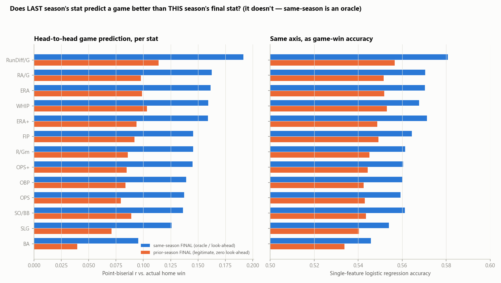

| Stat | r, same-season final | r, prior-season final | accuracy, same | accuracy, prior |
|---|---|---|---|---|
| RunDiff/G | **0.192** | 0.114 | **58.1%** | 55.7% |
| RA/G | 0.163 | 0.098 | 57.0% | 55.2% |
| **ERA** | **0.161** | **0.099** | **57.0%** | **55.2%** |
| WHIP | 0.159 | 0.103 | 56.8% | 55.3% |
| ERA+ | 0.159 | 0.094 | 57.1% | 54.9% |
| OPS+ | 0.145 | 0.085 | 56.0% | 54.4% |
| BA | 0.095 | 0.040 | 54.6% | 53.4% |

Full-season ERA beats prior-year ERA at picking individual games, **r = 0.161
vs 0.099, accuracy 57.0% vs 55.2%** — roughly 60% more explanatory power and
~1.8 points of accuracy. **But this is not a fair fight.** Same-season-final
ERA is computed using games that happened *after* the game being predicted —
it's an oracle, not a forecast. A team's final ERA already "knows" whether
that specific game was a good or bad one for its pitching staff. Prior-season
ERA has zero look-ahead: it's exactly what you could know on Opening Day. So
§10a answers "how much does knowing the whole season's truth help" (a lot),
not "what should a betting model actually use."

### 10b. The fair fight: rolling in-season stats (zero look-ahead) vs. prior-season final

To compare like with like, replace same-season-final with a **rolling,
cumulative-through-yesterday's-game** stat — computed directly from the
41,494-game log, using only games each team had already played. Both sides
of this comparison are now legitimate, real-time-available numbers. Tested on
RunDiff/G (a proxy for ERA + OPS combined) at increasing games-played
thresholds:

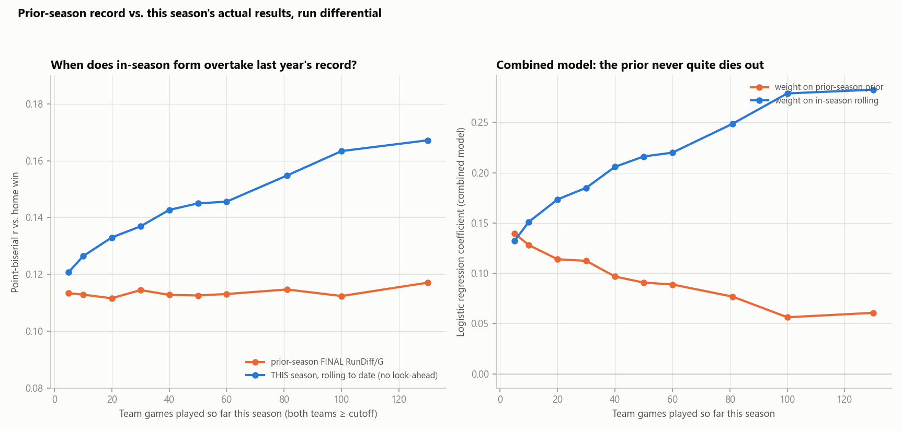

| Team games played (both sides) | r, prior-season final | r, in-season rolling | accuracy, prior | accuracy, rolling |
|---|---|---|---|---|
| 5 | 0.113 | 0.121 | 55.65% | 55.61% |
| 20 | 0.112 | 0.133 | 55.58% | 55.70% |
| 40 | 0.113 | 0.143 | 55.77% | 56.08% |
| 60 | 0.113 | 0.146 | 55.76% | 56.36% |
| 81 (half season) | 0.115 | 0.155 | 55.79% | 56.79% |
| 130 (~80% of season) | 0.117 | 0.167 | 55.63% | 57.11% |

**In-season form is at least as good as a whole prior season after as few as
5 team games**, and pulls clearly, steadily ahead from there — by the
20-game mark (about two weeks into the season) it's already a clear leader,
and the gap roughly doubles by the time teams have played 130 games. Two
things worth flagging: (1) prior-season's r barely moves across the whole
x-axis (0.112–0.117) — it isn't getting *worse*, in-season is just accumulating
real information faster than the year-old prior can compete with; (2) even 5
games of this year's data is noisy — the fact that it already roughly matches
a full prior season says more about how weak individual-game signal is in
general (baseball's day-to-day randomness is famously high) than about early-season
stats being reliable in an absolute sense.

**The prior never fully dies, though.** A combined logistic model
(prior-season + in-season, both as features) beats either alone at every
cutoff, and while the model's weight shifts hard toward the in-season number
as the season progresses (coefficient 0.13 → 0.28), the prior-season term
keeps a small, non-zero, statistically real weight all the way out to 130
games played (0.06–0.14, never crossing zero). **Practical read for the Elo
model:** the 60% carryover between seasons (§1) is doing something
defensible — it's not just a cold-start convenience, it's approximating a
genuine (if fast-decaying) Bayesian prior that real in-season results don't
fully wash out even late in the year.

---

## 11. Caveats & data-quality notes

- **`Clutch` and `aLI` columns in the advanced pitching export are corrupted** (287 rows with |Clutch| > 100, 335 rows aLI = 0.00 — clearly mis-scaled/blank in the BRef export). They were excluded from all conclusions; ignore the Clutch/G bar in the correlation chart.
- **WPA / REW / RE24 correlations are circular**: these metrics are computed *from* win/run events, so their high r values validate the bookkeeping, not a betting edge.
- **SV/G is partially outcome-contaminated** (saves require wins).
- **2020** (60 games) is excluded from all YoY/persistence/prior-season pairs on either side of the gap; **2026** is partial (≈115 games) — rate stats fine, counting stats normalized per game.
- Elo evaluation excludes the 2009–2011 fresh-start burn-in.
- 540 team-seasons is modest; the pitching > hitting asymmetry is robust here but is an era observation, not a law.
- **CG/G and SHO/G (§7) are era-confounded** — leaguewide complete-game rates fell steadily 2009→2026 independent of team quality; the within-season z-score removes cross-season drift but a team's *rank* on these stats each year is still noisier than its rank on rate stats like ERA+.
- **§8's prior-season sample is 450 team-season pairs** (540 minus one season per franchise for the lag, minus pairs touching 2020) — same n as the §5 persistence test, and both converge on the identical conclusion via different math, which is the best evidence the BB% finding is real and not a multiple-comparisons artifact.
- No fielding/defensive data (DRS, UZR, error rate) is in the source files — all "pitching" performance here is really pitching-plus-defense combined (ERA, WHIP, hits allowed). A defense-independent pitching metric (e.g. team-level xFIP or a separate fielding rating) would be a natural next addition to disentangle the two.
- **§10's game-level r values look small in absolute terms (0.09–0.19) compared to the team-season r values in §3 (0.5–0.9) — this is expected, not a contradiction.** A single game is decided by ~4 at-bats' worth of variance on top of true talent; team-season stats average that noise away over ~150 games. Single-game point-biserial r in the 0.1–0.2 range is roughly what published MLB game-prediction models (including market-derived ones) achieve — Vegas closing lines, which incorporate far more information than run differential alone, still only hit ~60% game accuracy.
- **§10b's rolling stat only uses runs scored/allowed** (available directly from the game log), not full ERA/OPS+ breakdowns, since those require per-game pitching lines the source data doesn't provide. RunDiff/G is a reasonable proxy — it's the stat with the single highest same-season association in §3 — but a rolling ERA specifically (earned runs only, excluding defensive misplays) might behave slightly differently.
- **§10's game count (34,320 in 10a) is smaller than the full 41,494-game dataset** because 2009 (no prior season available), 2020 (60-game season), and 2021 (prior season would be the 60-game 2020) are excluded from both comparisons for consistency.

## Appendix A: every stat tested, same-season association (52 stats)

Full ranked list, Pearson r on within-season z-scores vs. win% (n = 540
team-seasons each; complete tables with Elo-outcome columns and p-values live
in `data/mlb/analysis/all_stats_correlations.csv`):

| Stat | Group | r (win%) | Stat | Group | r (win%) |
|---|---|---|---|---|---|
| RunDiff/G | combined | 0.938 | HR9 | pitching | -0.505 |
| WPA/G | advanced* | 0.864 | BB% | hitting | 0.490 |
| REW | advanced* | 0.839 | XBH% | hitting | 0.457 |
| RE24/G | advanced* | 0.839 | HR% | hitting | 0.453 |
| WPA/LI | advanced* | 0.819 | BA | hitting | 0.416 |
| PtchW/G | advanced | 0.799 | LOB/G | hitting | 0.322 |
| PtchR/G | pitching | 0.799 | IBB_bat% | hitting | 0.300 |
| RA/G | pitching | -0.785 | SO% | hitting | -0.286 |
| ERA | pitching | -0.777 | SF/G | hitting | 0.278 |
| ERA+ | pitching | 0.777 | AB/SO | hitting | 0.218 |
| WHIP | pitching | -0.771 | WP/G | pitching | -0.216 |
| H9 | pitching | -0.696 | SHO/G | pitching | 0.212 |
| FIP | pitching | -0.691 | SB% | hitting | 0.205 |
| SO/BB | pitching | 0.672 | CS% | hitting | -0.204 |
| SV/G | pitching | 0.667 | HBP% | hitting | 0.179 |
| R/Gm | hitting | 0.662 | BK/G | pitching | -0.175 |
| RBI/G | hitting | 0.657 | CG/G | pitching | 0.168 |
| OPS+ | hitting | 0.638 | BAbip | hitting | 0.116 |
| BtRuns/G | hitting | 0.637 | SH/G | hitting | -0.091 |
| OBP | hitting | 0.628 | aLI | advanced† | 0.038 |
| Clutch/G | advanced† | 0.625 | SBatt | hitting | -0.007 |
| RC/G | hitting | 0.623 | GIDP/G | hitting | 0.007 |
| OPS | hitting | 0.618 | Hitting AIR | hitting | -0.002 |
| BF/G | pitching | -0.614 | | | |
| SLG | hitting | 0.563 | | | |
| BB9 | pitching | -0.549 | | | |
| TB/G | hitting | 0.529 | | | |
| ISO | hitting | 0.513 | | | |
| SO9 | pitching | 0.508 | | | |

\* Circular: computed from win/run events, not an independent predictor (see caveats). † `Clutch` and `aLI` are corrupted in the source export — ignore.

## 12. Reproduce

```
python mlb/build_games.py           # rebuild games CSV (Retrosheet + statsapi)
python mlb/tune_elo.py              # grid search -> data/mlb/elo_params.json + artifacts
python mlb/analysis.py              # first-pass association tables -> data/mlb/analysis/
python mlb/analysis_extended.py     # extra stats, prior-season, rank-vs-value -> data/mlb/analysis/
python mlb/game_level_analysis.py   # head-to-head prior vs same-season -> data/mlb/analysis/
python mlb/make_charts.py           # first-pass charts -> reports/charts/mlb_*.png
python mlb/make_charts_extended.py  # extra-stat/prior-season/rank charts -> reports/charts/mlb_*.png
python mlb/make_charts_gamelevel.py # head-to-head charts -> reports/charts/mlb_h2h_*.png
```
